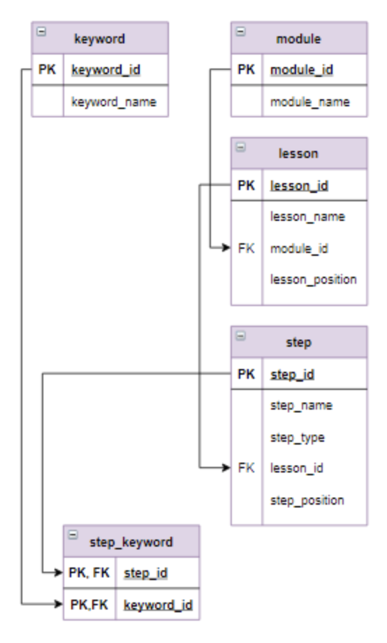

# Задача - Реализовать поиск по ключевым словам
Вывести шаги, с которыми связаны ключевые слова MAX и AVG одновременно.
Для шагов указать id модуля, позицию урока в модуле, позицию шага в уроке через точку, после позиции шага перед заголовком - пробел.
Позицию шага в уроке вывести в виде двух цифр (если позиция шага меньше 10, то перед цифрой поставить 0).

### Логическая схема базы данных
Ниже представлена структура таблиц, с которыми работают SQL-запросы.

### Используемые SQL-техники
- CONCAT - Конкатенация строк
- LPAD - Форматирование строк
- INNER JOIN и USING - Связывание 5 таблиц через цепочку внешних ключей
- REGEXP - поиск по регулярному выражению
- GROUP BY - Группировка записей
- HAVING, COUNT - Фильтрация после группировки
- ORDER BY - Многоуровневая сортировка
