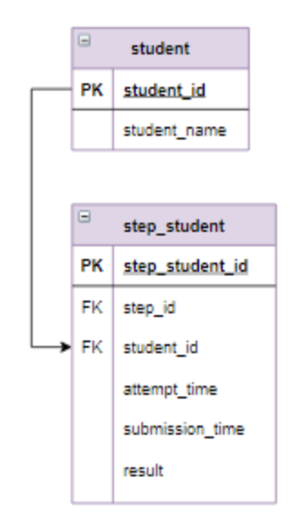

# Задача - Выборка данных по нескольким условиям, оператор CASE
Посчитать, сколько студентов относится к каждой возрастной группе.

### Логическая схема базы данных
Ниже представлена структура таблиц, с которыми работают SQL-запросы.

### Используемые SQL-техники
- CASE — создает категории на основе условий
- COUNT(DISTINCT) — считает уникальные значения в группе
- Подзапрос (subquery) — сначала вычисляет метрики для каждого студента, затем агрегирует по группам
- GROUP BY — группирует данные для подсчета количества в каждом интервале
- ORDER BY — сортирует результаты по категориям
