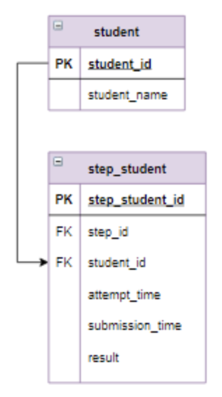

# Задача - Вычислить прогресс пользователей по курсу
Прогресс вычисляется как отношение верно пройденных шагов к общему количеству шагов в процентах, округленное до целого.
Общее количество шагов = количество различных шагов таблице step_student.
Тем пользователям, которые прошли все шаги (прогресс = 100%) выдать "Сертификат с отличием".
Тем, у кого прогресс больше или равен 80% -  "Сертификат".
Для остальных записей в столбце Результат задать пустую строку ("").
Информацию отсортировать по убыванию прогресса, затем по имени пользователя в алфавитном порядке.

### Логическая схема базы данных
Ниже представлена структура таблиц, с которыми работают SQL-запросы.

### Используемые SQL-техники
- SET — сохраняет количество уникальных шагов в переменную для переиспользования
- CTE (WITH) — создает временную таблицу с прогрессом студентов, выполнивших шаги правильно
- COUNT(DISTINCT) — подсчитывает уникальные шаги для каждого студента
- LEFT JOIN — подключает CTE к таблице студентов, сохраняя всех студентов, даже если у них нет правильных шагов
- ROUND — вычисляет процент прогресса с округлением
- CASE — определяет результат (сертификат) на основе процента выполнения
- ORDER BY — сортирует по убыванию прогресса и имени студента
